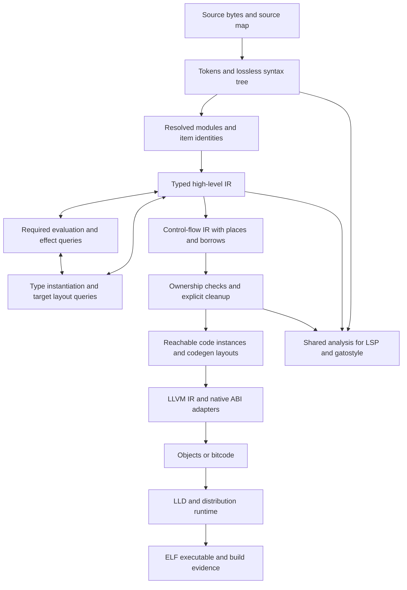

# Building the first meowy compiler

[Project](README.md) · [Language design](docs/design.md) · [Reference](docs/README.md)

Build the compiler and developer tools in **Rust**, use **LLVM, Clang, and LLD**
through a contained **C++20** backend, and write the standard library in **meowy**
above a small native runtime. Keep Python for development checks and test drivers.
The first output is a Linux x86-64 native executable.

This is the recommended implementation plan for v0.0.1. The language reference
defines behavior; the choices here define how to build it. A different host
language or backend would still have to satisfy those contracts. Proposed source
directories and build files below describe the implementation layout to create.

**v0.0.1 is the first full release, not a preview awaiting v1.0.0.** Its scope
includes the complete documented initial language, standard library, CLI,
developer tools, and distribution profile. The staged subsets below are
development milestones toward that full v0.0.1 release.

Project tags follow [Versioning, allegedly](VERSIONING.md): `v0.0.N` is a release
identifier, not a compatibility or scheduling promise. The scope above is the
current named implementation target; it is not a meaning assigned to every `0.0`
version, nor a requirement to wait for `v1.0.0`.

## The language split

| Part                           | Language                                                        | Responsibility                                                                                                   |
| ------------------------------ | --------------------------------------------------------------- | ---------------------------------------------------------------------------------------------------------------- |
| Compiler frontend and analyses | Rust, stable toolchain, edition 2024                            | Parsing, names, types, required evaluation, effects, ownership, specialization, and diagnostics                  |
| Compiler driver and tools      | Rust                                                            | CLI, package graph, build orchestration, artifacts, replay supervision, LSP, and gatostyle                       |
| LLVM backend bridge            | C++20                                                           | LLVM IR construction, optimization, debug information, object emission, and Clang native ABI lowering            |
| Native runtime                 | C++20 with explicit allocation and a restricted library surface | Task stacks, scheduler, channels, OS operations, panic machinery, and event recording                            |
| Foundational library           | meowy plus explicitly registered intrinsics                     | Public types, ordinary library algorithms, allocators, errors, collections, time, calendars, and CLI composition |
| Development harness            | Python 3 and small shell entry points                           | Conformance orchestration, schema checks, packaging checks, and native test fixtures                             |

Rust's enums and exhaustive matching fit syntax and intermediate representations.
Use owned arenas, interned names, and typed integer IDs for compiler graphs. This
keeps graph lifetimes manageable without making every node a reference-counted
object. Rust checks the compiler's memory use; **meowy's borrow checker is a
separate analysis we must write**.

C++ gives the backend direct access to LLVM and Clang internals. Keep it behind
an explicit interface so an LLVM upgrade changes one subsystem. The runtime uses
the same native toolchain but is a separate library: ordinary runtime linkage
must not pull in the compiler, its Rust standard library, Clang, or LLVM.
Explicitly selected native artifacts retain their own declared dependency closure.

The implementation language does not define the output's memory model. Compiler
processes may allocate while analyzing a program. Generated programs must follow
meowy's explicit allocation, borrowing, and cleanup rules, with no tracing GC.

## Tools worth bringing along

Add dependencies when their component starts. Pin the exact dependency graph in
`Cargo.lock`; a list of crates is not a request to install an entire ecosystem.

| Tool or library                                                                                                                              | Use it for                                                 | Boundary                                                                               |
| -------------------------------------------------------------------------------------------------------------------------------------------- | ---------------------------------------------------------- | -------------------------------------------------------------------------------------- |
| Cargo, rustfmt, Clippy                                                                                                                       | Build, test, and maintain Rust components                  | Pin Rust in `rust-toolchain.toml`; release builds use the lockfile                     |
| [rowan](https://github.com/rust-analyzer/rowan)                                                                                              | Lossless concrete syntax trees                             | Write meowy's lexer and parser; rowan stores their output                              |
| [serde / serde_json](https://github.com/serde-rs/json)                                                                                       | Typed tool messages and artifact structures                | Implement the specified canonical encoding and strict reader validation separately     |
| [clap](https://docs.rs/clap/latest/clap/)                                                                                                    | The compiler's CLI argument handling                       | Follow the existing command contract; meowy's `cli` package remains a separate library |
| [lsp-server](https://github.com/rust-lang/rust-analyzer/tree/master/lib/lsp-server) and [lsp-types](https://github.com/gluon-lang/lsp-types) | LSP transport and protocol types                           | Share the compiler analysis; negotiate only supported protocol features                |
| [object](https://github.com/gimli-rs/object)                                                                                                 | Inspect ELF files, symbols, sections, and relocations      | LLD does the linking; this supports verification and build reports                     |
| [RustCrypto sha2](https://github.com/RustCrypto/hashes)                                                                                      | SHA-256 input and artifact identities                      | Hash the exact bytes required by each meowy format                                     |
| CMake and Ninja                                                                                                                              | LLVM, the bridge, and the native runtime                   | Keep native build configuration in checked-in presets                                  |
| LLVM tools                                                                                                                                   | Inspect IR, assembly, debug information, and linked output | Bundle matching tools when a user-facing command or capsule needs them                 |
| [lit and FileCheck](https://releases.llvm.org/22.1.0/docs/TestingGuide.html)                                                                 | Small backend and native ABI regression tests              | Assert relevant properties, rather than whole optimized IR dumps                       |
| [proptest](https://github.com/proptest-rs/proptest) and [cargo-fuzz](https://rust-fuzz.github.io/book/cargo-fuzz.html)                       | Property tests and malformed-input exploration             | Fuzz tooling can have its own pinned toolchain; shipping builds stay on stable Rust    |

Keep a concrete inspection kit from the same LLVM build: `llvm-dis` to read
bitcode, `opt` to verify and investigate IR passes, `llc` to isolate machine-code
generation, `llvm-readobj` and `llvm-nm` to inspect linked inputs, `llvm-objdump`
to inspect instructions, and `llvm-size` for section totals. Use
`llvm-dwarfdump` to check debug information and `llvm-symbolizer` to resolve
addresses. Their interfaces are collected in the
[LLVM command guide](https://releases.llvm.org/22.1.0/docs/CommandGuide/index.html).
Use [LLDB](https://lldb.llvm.org/use/tutorial.html) for native debugging; emitting
DWARF is the first step, while readable meowy values also need language-aware
type descriptions and debugger tests.

Keep the first analysis engine ordinary: immutable source snapshots, explicit
dependencies, and memoized queries with cycle detection. It is fine to invalidate
a whole module initially. The
[rust-analyzer architecture](https://rust-analyzer.github.io/book/contributing/architecture.html)
is useful reading for separating syntax, semantic analysis, and editor requests.
Adopt more elaborate incremental machinery when measurements justify it.

## Pin a toolchain, not somebody's workstation

Use **LLVM 22.1.8** as the initial backend candidate, with Clang, LLD, compiler-rt,
and libunwind from the same `llvmorg-22.1.8` source release. This is a proposed
baseline to qualify, not a claim that a complete meowy distribution has passed
qualification. Record the resolved revision, archive checksums, build options,
patches, and resulting payload digests. The upstream
[release](https://github.com/llvm/llvm-project/releases/tag/llvmorg-22.1.8)
provides source archives and verification material.

Choose an exact stable Rust release when establishing the bootstrap, test that
release with the selected crates, and commit the pin. `edition = "2024"` selects
language rules; Cargo's [`rust-version`](https://doc.rust-lang.org/cargo/reference/rust-version.html)
declares the supported compiler floor. Neither replaces the exact release pin.
Record CMake, Ninja, Python, native bootstrap compiler, and dependency versions
in the bootstrap inventory too.

Use a Cargo workspace for Rust and CMake presets for native code, with one small
Rust `xtask` build driver coordinating them. Its jobs are preparing the pinned
toolchain, building components, running suites, and assembling a distribution.
Cargo build scripts may integrate these maintained native components; dependency
source does not gain access to meowy application build hooks.

The LLVM developer preset should select `clang;lld`, the `X86` target, a release
build with LLVM assertions, and bounded compile/link parallelism. Build the
required compiler-rt and unwind libraries for the target sysroot in a separate
runtime preset. CMake 3.20 is the LLVM 22 documented minimum; select and pin a
tested version. The [LLVM CMake guide](https://releases.llvm.org/22.1.0/docs/CMake.html)
documents these project, target, assertion, and parallelism options.

The initial [target profile](docs/reference/target-profile.md) is already precise:

- Host and output: `x86_64-unknown-linux-gnu`, baseline x86-64/SSE2.
- Minimum execution environment: Linux 5.4 and glibc 2.31 for dynamic output.
- ELF64, System V AMD64 C ABI, LP64, and DWARF 5.
- Dynamic PIE and verified static output; LTO `off`, `thin`, and `full`.
- Required unwind information survives stripping and debug separation.

Build against a pinned sysroot containing the headers, glibc, CRT objects,
thread/unwind libraries, and compiler support archives needed for this profile.
Build the shipped tools against their declared host baseline too. Merely setting
a target triple on a modern workstation does not establish the minimum glibc
requirement; inspect the final versioned symbols and test the distribution on
the minimum supported environment.

Maintainers need bootstrap tools. A meowy user needs the assembled distribution:
compiler, backend, linker, runtime, standard library and rule data, sysroot, and
descriptor. The driver resolves tools by exact distribution paths. Ambient
`CC`, `CFLAGS`, `LDFLAGS`, host headers, and same-name native libraries are not
application build inputs. Follow [LLVM's distribution guidance](https://llvm.org/docs/BuildingADistribution.html)
when selecting installed components, then inventory the actual closure in
[`distribution.json`](docs/reference/artifact-formats.md).

Vendor the Rust dependencies and retain verified native source inputs so the
compiler can be rebuilt offline after preparation. Cargo's
[`vendor`](https://doc.rust-lang.org/cargo/commands/cargo-vendor.html) command
supports local dependency sources. Preserve dependency licenses and notices
alongside the distribution's build provenance.

## The pipeline

Keep the information that explains a program until the last phase that needs it.
Ownership diagnostics are much easier before every value becomes a pointer.



**Source and parsing.** Store original UTF-8 bytes and half-open byte spans.
Retain comments, whitespace, and invalid syntax in the concrete tree for editor
recovery and formatting. Use a hand-written lexer, recursive descent for forms,
and a Pratt parser for expressions. Explicitly track matcher and type contexts:
`value<T>` cannot change meaning merely because somebody inserted a space.
Complete type syntax wins according to the reference without consulting the
symbol table. Test nested angles, zero-space programs, interpolation, and
newline termination from the start. See [syntax](docs/reference/syntax.md).

**Names and types.** Resolve ordinary names to stable item IDs, including
well-known intrinsics. Never recognize `self`, `leave`, `Copy`, or `true` by
spelling after resolution. Preserve type, value, and label namespaces; package
identity also contributes to nominal identity. A typed high-level representation
should retain block emissions, match narrowing, exact record shape, unions,
function-item identity, generic constraints, and callable capabilities.
An emission initializes a block component; it does not return from a function.

**Required evaluation.** Implement a deterministic interpreter over checked
expressions, with explicit values for compile-time types and descriptors. Type
checking and evaluation call each other through cycle-checked queries: a helper
can compute a type needed by subsequent checking. Type instantiation and target
layout are available here too, for `memory.size_of<T>()`, `align_of<T>()`, and
native record construction. Legal recursive function groups and effect analysis
need fixed-point handling; distinguish those from cyclic type construction.
Use target integer widths and floating-point semantics, rather than accidentally
inheriting host arithmetic.
The [evaluation budgets](docs/reference/compile-time.md) count logical work even
when a result is cached. A required result cannot fall back to runtime execution.
Keep this evaluator inside the compiler; a JIT is unnecessary for this job.

**Ownership and cleanup.** Lower to a control-flow graph with explicit storage
places, reads, writes, moves, initialization flags, borrows, and scope exits.
Use dataflow analysis for last use and possible initialization, including partial
moves and closure captures. Track lexical task ownership and borrowed captures
in the same model. Insert cleanup edges for ordinary completion, early exits,
restart, panic, and cancellation. A child's join must precede destruction of
locals it can borrow. Full-statement temporary lifetimes and returned-borrow
summaries belong here. See [memory](docs/reference/memory.md).

**Specialization.** Check generic bodies against their declared constraints,
then materialize code instances and code-generation layouts for reachable uses,
reusing the semantic instantiation and layout queries above. Cache by item
identity, complete type arguments, required values, and target/distribution
identity. Catch recursive requests without confusing legitimate recursive calls
with endlessly growing specialization. Preserve source provenance through this
phase so an error in a specialization can explain both definition and use.

**Code generation.** Lower only checked operations. Initially use explicit
storage and ordinary loads/stores where that keeps the lowering simple; LLVM
can promote suitable locals. Emit arithmetic and bounds checks in every profile.
Do not attach `nsw`, `nuw`, `inbounds`, `noalias`, or fast-math promises unless
meowy's analysis proves the particular promise. Optimization must preserve
defined failures, aliasing, float behavior, and cleanup.

## Three native interfaces, three jobs

The Rust-to-C++ bridge, meowy's private runtime ABI, and the public C FFI are
different interfaces. Give each a versioned internal contract and tests.

The **compiler bridge** takes checked lowering requests and exposes opaque
handles, byte buffers, explicit lengths, status results, and paired release
functions. Keep LLVM contexts, modules, and C++ objects on its side of the
boundary. No Rust panic or C++ exception may cross it. Backend failures retain
phase information for diagnostics and capsules. Invoke the bundled LLD as a
subprocess initially, capturing exact arguments and streams; this also makes
link failures straightforward to replay.

For **native calls**, use the pinned Clang CodeGen implementation behind that
bridge to obtain C record layout and argument/result classification. Maintain
the necessary adapter to Clang's internal APIs with the pinned LLVM revision.
Clang's [LibTooling](https://clang.llvm.org/docs/LibTooling.html) provides a way
to drive frontend actions, but parsing a C declaration alone does not implement
its calling convention. Compare generated adapters against separately compiled
C fixtures, especially small mixed-field aggregates and indirect returns.
Follow [native ABI](docs/reference/native-abi.md): `ffi.extern` produces a
meowy-callable adapter, not a raw C function pointer.

For **runtime calls**, define ownership of every argument, allocation behavior,
failure result, suspension permission, and unwind behavior. Use status returns
for OS operations and resource admission. Compiler-generated meowy frames turn
statuses into the documented values or panic paths. Keep native allocations
fallible and accounted for; avoid implicit C++ container growth and exception
translation in these paths.

## Prove the runtime before it gets comfortable

Start the runtime with explicit allocators, output, and generated cleanup. Then
make a small task prototype before building the whole standard library. The
interesting test is a child that borrows a parent local, suspends, gets cancelled,
and cleans up before that parent local disappears.

Use pthread workers and pinned stackful task contexts. Prototype the stack
switch using a vendored, revision-pinned
[Boost.Context](https://github.com/boostorg/context) primitive behind a private
wrapper. It supports suspension within nested calls; meowy's scheduler must
impose worker pinning, admission limits, and structured lifetimes. Qualify that
wrapper before committing the runtime ABI to it: stack allocation, guard pages,
register preservation, sanitizer hooks, and unwind behavior need executable
tests. High-level C++ continuation destruction must not become meowy cancellation.
Keep the context-switch dependency replaceable without changing language rules.

The runtime owns scheduling, channel queues, timers, and OS readiness integration.
A waiting task yields its worker so another task can run. Blocking native calls
follow their separate documented limitations. Task stacks use the configured
budget and allocator; allocation failure becomes an admission outcome. The
[task contract](docs/reference/tasks-and-channels.md) determines when a task can
start, suspend, finish, and release its captures.

Use LLVM's DWARF exception-handling support with a meowy personality routine,
generated landing pads, and the pinned unwind library. Panic payloads and
cancellation states belong to meowy. A generated task-root handler finishes
meowy cleanup and produces an outcome before returning to scheduler frames.
Foreign adapters cannot allow exceptions to cross the public C boundary. A
second panic during cleanup takes the documented fatal path. These are explicit
runtime rules; host C++ destructors or Rust panics cannot supply them by accident.
LLVM documents the [personality, landing-pad, and unwind mechanism](https://llvm.org/docs/ExceptionHandling.html).

Test cancellation while a parent is joining, channel closure during a send,
zero-capacity rendezvous, exhausted task budgets, and panic after a partial move.
Exercise the combination of suspended stacks and active cleanup, including
cleanup that must wait for children. Passing independent scheduler and unwinder
tests is not enough to qualify their interaction.

## Borrow and dereference syntax migration

The [pointer syntax migration](compiler/docs/BORROW_SYNTAX.md) completed on 2026-09-09:
tight prefix `&`/`&!`/`*`, selected-field `.&`/`.&!`/`.*`, migrated sources and
compiler/native/editor checks. Existing ownership and backend representations remain
unchanged. Resume wider carried-slot capabilities using the new grammar.

## Documentation completion slice

Completed for the standalone bootstrap profile on 2026-09-09: attachment, checked
links/signatures, doc check/build, basic safe API pages and checked/opt-in examples.
Compiler/native and editor gates passed. The broader package/LSP/assets/index-format
contract remains separate; this is not a reason to extend this slice. Return to
the reference-free record-slot compiler work next.

Finish a usable documentation feature in one bounded implementation run, rather
than stopping after each internal piece for another continuation. Reuse the compiler
and test infrastructure; do not build a new general-purpose framework for this work.
The [documentation contract](docs/reference/documentation.md) supplies the semantics;
unsupported compiler capabilities must remain explicit rather than being presented
as completed documentation support.

1. Attach recognized doc blocks to supported modules, declarations, parameters and
   fields. Preserve exact spans, diagnose orphaned/duplicate/misplaced blocks, assign
   the necessary diagnostics and replace the blanket B001 gate only with checked support.
2. Resolve structured value/type links against compiler-checked bindings. Keep
   declaration identities and one documentation model; do not infer another type
   system from prose or rewrite ordinary text by spelling.
3. Implement `meowy doc check` and `meowy doc build` with basic deterministic local
   API pages, safe output replacement and the documented offline/project policies.
4. Check complete examples and expected language rejections through the compiler.
   Run explicitly runnable examples only on request through existing test machinery.
   Missing tools, unsupported features and crashes are not successful examples.
5. Run the relevant compiler/native/editor/documentation checks, resolve the bounded
   feature's failures, update concise STATUS handoffs and commit cohesive changes
   together. Stop for a genuine blocker requiring user input, not for routine milestones.

Done means supported doc-commented programs compile correctly, malformed attachment
and links are diagnosed, the doc commands produce useful checked output, and their
regressions pass. No claim is made that unavailable language/library features work
inside an example. Do not spend this slice on rendering polish or optional extras.

Full LSP/rename integration waits for that infrastructure. Networking/TLS implementation
and release-compatible public documentation interchange formats remain separate
tracks. Once this bounded feature works, stop documentation expansion and return
to core compiler work, starting with the recorded reference-free record-slot slice.

## Standard library, tools, and failures share the compiler

[Documentation comments](docs/reference/documentation.md) retain source trivia,
declaration attachment, resolved links and example source maps in this shared
pipeline. Signatures and ownership facts come from analysis, not prose tags.
Rendering/LSP never execute examples; explicit doc checks reuse test-process
machinery. Assign diagnostics and register any public index schema before claiming
compatible documentation tooling.

[Networking](docs/reference/stdlib/net.md) is one `@"net"` package. `net.peer()`
builds a capability-typed owner from a transport and optional sender/receiver roles;
at least one role and a compatible transport are required before explicit startup.
Direct address/DNS/TCP/UDP APIs retain their semantics and remain usable alone.
[HTTP](docs/reference/stdlib/http.md) lives under `net.http`: messages, protocol
adapters, codecs and optional closed route/response-policy composition. There is
no separate HTTP import, client factory or serving lifecycle. Reuse JSON owners
and existing I/O/task lifetimes. [TLS](docs/reference/stdlib/tls.md) remains an
explicit stream-security contract requiring a qualified provider and trust policy.
These contracts do not implement a networking library by themselves.

Implement this merger in dependency order after module, type-specialization,
ownership and I/O/task foundations are executable:

1. Preserve direct numeric addresses, DNS, TCP streams and UDP datagrams. Qualify
   progress, truncation, deadlines, cancellation and host-resource cleanup.
2. Implement concrete peer configuration types, transport/role compatibility and
   operation availability. Reject missing/duplicate roles, mismatched adapters and
   operations unavailable on the configured type; do not erase capabilities into
   runtime flags. Add assigned diagnostics rather than inventing bootstrap codes.
3. Implement explicit start, bounded admission, failure ownership, stream/event
   leases and shared stop/join/close. Prove partial startup cleanup, receiver-only
   replies, combined-role budgets and no detached tasks or dangling captures.
4. Qualify raw sender/receiver adapters without manufacturing message boundaries
   for TCP or reliable delivery/request correlation for UDP. Keep unused HTTP and
   security services outside the reachable native closure.
5. Add net.http sender/receiver adapters, qualified TLS composition, incremental
   framing, leases, partial failures, response commitment and HTTP version gates.
6. Add typed endpoint calls, optional routers, response-policy/schema agreement,
   controlled transports and generated documentation under the shared peer model.

Parser, socket, cancellation, wire-version and schema gates remain separate from
documentation checks. The current change is a specification migration, not a
network runtime implementation or a newly qualified compiler capability.

Build ordinary algorithms in meowy: errors, inline collections, formatting,
duration arithmetic, then allocated collections and I/O wrappers. Add tasks and
channels once the runtime passes its gates. Layer testing, JSON, CLI composition,
date/time, and calendar modules on those foundations. Intrinsic identities and
their typing, purity, ownership, and code-generation rules live in one explicit
registry. A standard-library filename or familiar binding name grants no magic.

Use the [stdlib reference](docs/reference/stdlib/README.md) as the API contract.
Pin Unicode, time-zone, and calendar rule data as distribution inputs; keep their
modules independently reachable. Any third-party algorithm or native library
needs an adapter that preserves meowy's allocation, error, and data-version
contracts. Importing `time` must not retain a calendar database simply because
both were implemented in one enormous native translation unit.

The CLI, LSP, and gatostyle consume the same source snapshots, name resolution,
types, ownership results, and diagnostic objects. LSP converts byte spans to the
negotiated client position encoding and discards stale results. All project
configuration comes from [`mod.mwy`](docs/guide/mod.md), as the
[LSP contract](docs/reference/lsp.md) requires. Gatostyle uses the lossless tree
for layout and semantic evidence for quality fixes; a changed spelling must
preserve evaluation, moves, borrows, and cleanup before it can be an automatic
semantic rewrite.

Give diagnostics structured codes, spans, evidence, and repair candidates before
writing their terminal renderer. Use the existing
[schemas](docs/schemas/README.md) and [artifact formats](docs/reference/artifact-formats.md).
Library JSON serialization alone does not enforce duplicate-key rejection,
canonical hashes, path confinement, resource budgets, or reader compatibility.

Start preserving failed-phase inputs and exact commands with the first CLI
slice. Add the isolated executable capsule, distribution closure, and integrity
checks as the packaging layer matures. A checking failure replays checking; a
runtime failure replays the preserved program. Replay must remain usable after
the original workspace is moved away.

Put recording hooks at runtime effect boundaries as those operations are added.
Use the exact [runtime event registry](docs/reference/runtime-events.md), logical
resource IDs, and input/event limits. Replay consumes those events and checks
divergence. Unsupported effects produce the specified external/incomplete state;
a copied executable alone is not evidence of a recorded closed execution. The
[recording profile](docs/reference/replay-recording.md) defines that distinction.

## Make small binaries deliberately

Compute reachability from the entry, observable module initialization, generated
cleanup, address-taken functions, and required runtime services. Specialize and
emit reachable library definitions, then give LLD independently removable code
and data sections. Keep provenance for why a definition or native artifact is
retained. LLVM optimization and linker stripping complete this work; they do not
replace the source-level dependency and effect analysis.

Use section garbage collection, safe identical-code folding, and the requested
LTO mode according to [build policy](docs/reference/optimization.md). Verify the
linked ELF rather than inferring its contents from flags. Static mode must
reject the unsupported DNS/NSS and dynamic-loader closure described by the
target profile. Report actual loader dependencies and symbol versions for shared
mode. Debug files, unwind metadata, and build IDs have separate retention rules.

Measure a few useful baselines: scalar calculation, streaming greeting, duration
arithmetic, one channel, and one selected calendar. For each, record compiler
time and peak memory, executable sections, runtime peak memory, stack budgets,
and native dependencies. Compile-time RAM, executable bytes, virtual mappings,
and resident pages are different budgets. An old laptop should be able to use
the prebuilt distribution without rebuilding LLVM.

## A source tree with room to grow

Start modules inside a few crates; split a crate when its dependency boundary is
useful. The following is a proposed layout, not another source of user settings:

```text
Cargo.toml                 Rust workspace
Cargo.lock                 pinned host dependencies
rust-toolchain.toml         exact bootstrap Rust release
compiler/                  source, syntax, resolve, types, eval, MIR, ownership
driver/                    meowy command, package graph, builds, and sessions
tools/                     LSP, gatostyle, shared diagnostic rendering
backend/llvm/              C++ bridge and native ABI lowering
runtime/                   allocation, stacks, scheduling, unwinding, recording
stdlib/                    meowy library sources and pinned rule data
bootstrap/                 source inventories, sysroot recipe, CMake presets
xtask/                     maintained build and distribution orchestration
tests/                     compiler, backend, ABI, runtime, replay, and tool tests
docs/conformance/          language contract fixtures
docs/schemas/              public format schemas and examples
```

Rust/CMake bootstrap configuration builds meowy itself. Application configuration
continues to live in `mod.mwy`. Internal IR and runtime ABI versions are tied to
the distribution; public artifact versions follow their explicit compatibility
rules. Do not silently turn an internal serialization format into a public API.

## Build in slices with observable gates

Each slice should leave a working path from input to evidence. Early milestones
cover an explicit subset; reject unsupported constructs instead of assigning
them temporary semantics. Completing a slice is not a claim to support the whole
v0.0.1 language profile.

| Slice                | Deliverable                                                                                              | Gate                                                                                                  |
| -------------------- | -------------------------------------------------------------------------------------------------------- | ----------------------------------------------------------------------------------------------------- |
| 1. Parse and explain | Source maps, lossless parser, ordinary-name resolution, structured diagnostics, and a conformance runner | Compact and spaced fixtures agree; malformed input recovers with correct byte spans                   |
| 2. Produce an ELF    | Scalar checking, blocks, functions, control flow, checked arithmetic, LLVM emission, and bundled linking | Accepted programs run; debug/release agree; overflow remains a defined failure                        |
| 3. Own values        | Aggregates, moves, borrows, captures, initialization tracking, and generated cleanup                     | Use-after-move/borrow violations reject; each initialized owner is destroyed exactly once             |
| 4. Construct types   | Required evaluator, effects, constrained generics, specialization, and foundational intrinsics           | Budgets and purity reject consistently; generic errors retain useful source evidence                  |
| 5. Run owned work    | Qualified stack/unwind prototype, task lifecycle, channels, timers, and recording hooks                  | One-worker waits make progress; cancellation joins children; panic preserves cleanup order            |
| 6. Build projects    | Imports/aliases, locked packages, native adapters, meowy library layers, and build reports               | Offline builds use the locked graph; C ABI fixtures agree; unused library code stays out              |
| 7. Use the ecosystem | Test runner, LSP, gatostyle, isolated failure capsules, recording and replay                             | Shared diagnostics agree; repairs recheck; a capsule reproduces away from its source tree             |
| 8. Qualify v0.0.1    | Complete documented initial language, library, CLI, and distribution profile                             | All required coverage, target/link/LTO/debug combinations, format readers, and deployment checks pass |

Run the task/unwind prototype alongside slices 2–3 so its findings can influence
cleanup lowering. Start diagnostic/artifact structures in slice 1 and complete
their executable packaging in slice 7. This ordering keeps the difficult
interfaces visible while each feature still has a small surface.

For release qualification, maintain a coverage map from reference rules and
public library operations to tests. Run accepted and rejected
[conformance sources](docs/conformance/README.md) independently, then the
[worked projects](docs/programs/README.md), stdlib tests, and tool workflows.
Missing tools, failed linking, or a crashed checker cannot count as a successful
expected rejection. The existing `docs/conformance/check.py` validates the
catalog; the compiler harness must actually check and execute the cases.

Add backend tests for ABI lowering, overflow checks, cleanup edges, and DWARF;
property tests for compact syntax and equivalent expressions; and fuzz targets
for the parser, evaluator, artifact readers, and replay decoder. Use
[AddressSanitizer](https://clang.llvm.org/docs/AddressSanitizer.html) and
[UndefinedBehaviorSanitizer](https://clang.llvm.org/docs/UndefinedBehaviorSanitizer.html)
on native components in dedicated development builds. Qualify fiber-switch
instrumentation before treating sanitizer results on task stacks as meaningful.

Finally, exercise allocation failure, task/channel exhaustion, recording limits,
truncated capsules, and replay divergence. Test deployment with constrained
memory and the minimum host profile. Containers are useful for filesystem and
resource limits; use a suitable VM or actual minimum host to test the kernel
baseline. Rebuild from pinned inputs in two clean directories and compare the
outputs promised to be reproducible, accounting for the documented path policy.

The first satisfying milestone is small: punctuation goes in, an ELF comes out,
and a failure explains itself. Every following slice should keep that property.
