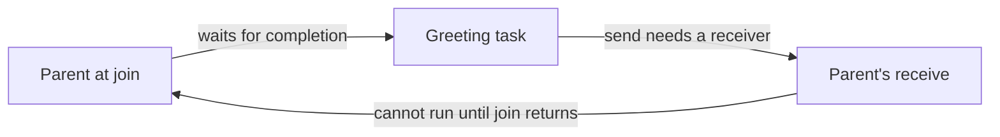

# Deadlocks and shutdown

[Pawterns](README.md) · Previous: [Tasks and channels](tasks-and-channels.md) · Next: [Make the tools pull their weight](toolchain-workflow.md)

A greeting needs only `debug.print("Hello, world!")`. Once there is useful work
to exchange, channels add an ownership protocol: someone sends, someone drains,
and someone makes closure observable. Borrow checking protects memory lifetimes;
it does not prove that those participants will make progress. You can own every
byte correctly and still spend eternity waiting to say hello.

## Hello, world. Goodbye, wait cycle.

**Use this when:** a parent consumes a child's output. Start with a zero-capacity
channel to make the required rendezvous explicit: neither side can rely on an
unused queue slot to hide the wait.

Create `mod.mwy`:

```meowy
-> build : {
    -> entry : "./main.mwy"
    -> profile : "debug"
    -> executor : {
        -> workers : 2
        -> max_tasks : 4
        -> stack_bytes : 65_536
        -> allocator : "system"
    }
}
```

Create `main.mwy`:

```meowy
channel : @"channel"
debug : @"debug"
memory : @"memory"

greet <null><channel.Rejected<string>> : (sender <channel.Sender<string>>) {
    output := sender
    sent : output.send("Hello, world!")
    output.close()
    -> sent
}

status <int32> := 0

'main {
    endpoints : channel.bounded<string>(memory.heap, 0)
    | endpoints <memory.AllocationFailure> | {
        debug.print("Cannot allocate the channel")
        status = 1
        'main.leave()
    }

    input := endpoints.receiver
    producer : >> greet(endpoints.sender)

    'drain {
        item : input.receive()
        | item <channel.Closed> | 'drain.leave()
        debug.print(item.value)
        'drain.restart()
    }

    produced : << producer
    | produced <error> | {
        debug.print("Greeting task: {produced}")
        status = 1
    }
}

-> status
```

Run `meowy check` and `meowy run` from that directory. A successful run prints
`Hello, world!` once and exits with status 0. The parent waits for messages before
joining the producer. The producer transfers the greeting, closes the last
sender, and settles; the parent observes closure and then collects its outcome.
The literal string has static backing, so the message contains no borrow of a
shorter-lived local owner.

**DO NOT RUN — the broken ordering.** In the preceding entry, moving the join
ahead of the drain loop would create this dependency:

```meowy
producer : >> greet(endpoints.sender)
produced : << producer
```

This is a fragment replacing the submission and moving the later join; the
parent still owns the only receiver. With capacity zero, the child cannot finish
its send until that parent receives. The parent cannot receive while waiting
for the child to finish.



The working code repairs the wait order. Increasing capacity may conceal this
specific greeting bug, but a longer producer can fill any finite queue. For a
separate producer and consumer, start both children before the parent joins
either, as in the [producer/consumer project](../programs/channel/README.md).

**Failure and ownership:** a failed producer admission releases its captured
sender. The receiver then observes closure rather than waiting for a body that
will never run, and the join exposes `tasks.SpawnFailed`. Other task failures
also remain outcomes to inspect. A drained channel is an end-of-stream signal;
it does not establish that its producer succeeded.

See [backpressure and deadlock](../reference/tasks-and-channels.md#backpressure-and-deadlock)
and [channel result types](../reference/stdlib/tasks-and-channels.md#channels).

## The spare sender keeping everyone after hours

**Use this when:** a producer/consumer pipeline waits for `channel.Closed` to
finish. This is common when several producers have their own explicit clones.

Begin with the complete [channel project](../programs/channel/README.md): its
[entry](../programs/channel/main.mwy), [workers](../programs/channel/workers.mwy),
and [manifest](../programs/channel/mod.mwy). The consumer adds each received value
and ends when the last sender closes. The parent must account for **every**
sender owner, including a clone it never uses.

**DO NOT RUN — retaining an unused sender.** Adding this line immediately after
the successful channel-construction check, before either child starts, changes
the shutdown protocol:

```meowy
spare : endpoints.sender.clone()
```

If the rest of the original entry is unchanged, `spare` survives until the
parent's `'main` scope ends. It sends absolutely nothing and still manages to
keep everyone at work. The producer sends all four values and closes its
sender. The consumer drains those values and waits for another message or
closure. The parent joins the consumer, but the parent's own sender prevents
closure. Scope cleanup cannot repair this order because the parent has not
reached scope exit.

To practice the repair, replace the original entry's section from `deadline`
through `consumed` with this fragment; all other declarations, error checks,
and worker functions stay as supplied by that project:

```meowy
spare : endpoints.sender.clone()
deadline : time.after(time.Second)
producer : >> workers.produce(endpoints.sender)
producer.deadline(deadline)
consumer : >> workers.consume(endpoints.receiver)
consumer.deadline(deadline)

spare.close()

produced : << producer
consumed : << consumer
```

The extra owner is released before the join that depends on closure. A successful
run still prints `Sum: 10`. In real code, keep a clone only while it has a producer
role; when that role ends, close it or end its scope. Each producer needs its own
sender because endpoint operations require exclusive access.

The original project's deadlines can eventually interrupt the broken consumer's
wait. That turns the error into a timeout; it does not make its shutdown order
correct. Its sum is not reported as a successful completion.

| Shutdown action               | What a waiting peer observes                       | Data consequence                              |
| ----------------------------- | -------------------------------------------------- | --------------------------------------------- |
| Close one of several senders  | Other senders may still send                       | Buffered messages remain available            |
| Close the last sender         | Buffered items, then `channel.Closed`              | Successfully queued messages can be drained   |
| Close the receiver            | Blocked sends wake with `Rejected<T>`              | Queued owners are released without processing |
| Cancel a blocked sending task | The task unwinds when it acknowledges cancellation | Its untransferred message is released         |

**Failure and ownership:** choose draining shutdown when queued work must still
be processed. Choose receiver closure when queued work may be discarded, and
make senders handle their rejected owners. Neither choice reverses side effects
that a consumer already performed. A successful send alone cannot acknowledge
that processing finished; use a task result or an explicitly designed response
message when that distinction matters.

For any shared resource, apply the same dependency check: do not hold access
that another participant needs while waiting for that participant to finish.
Adding workers does not break an ownership-dependent wait cycle. A task's status
snapshot also cannot prove that it is safe to stop draining or drop a required
endpoint.

See [endpoint closure](../reference/tasks-and-channels.md#channels),
[scope cleanup](../reference/tasks-and-channels.md#scope-exit), and the
[task status contract](../reference/stdlib/tasks-and-channels.md#tasks).

## Cancellation is a request, not a trapdoor

**Use this when:** an operation has a time budget, but its captured storage must
remain valid until the child stops using it. A deadline requests cooperative
cancellation; joining establishes that cleanup finished.

Reuse this chapter's `mod.mwy`. Replace `main.mwy` with:

```meowy
debug : @"debug"
tasks : @"tasks"
time : @"time"

wait_for_work <null> : () {
    'wait {
        tasks.checkpoint()
        time.sleep(time.Millisecond.scale(10))
        'wait.restart()
    }
}

status <int32> := 0
%service <null[1]>
%service.deadline(time.after(time.Millisecond.scale(50)))
%service >> wait_for_work()

outcomes : << %service
outcome : &(outcomes[1])

'report {
    | *outcome <tasks.Timeout> | {
        debug.print("Deadline acknowledged; child cleanup finished")
        'report.leave()
    }
    debug.print("Unexpected service outcome: {*outcome}")
    status = 1
}

-> status
```

With successful admission, the child continues until it acknowledges its
deadline, then the parent prints the confirmation and exits with status 0.
The service intentionally has no normal completion; admission failure or another
task failure reaches the unexpected-outcome message and returns status 1. Setting the
group deadline before submission avoids depending on whether the child starts
before a later handle update.

The 50 milliseconds is a cancellation deadline, not a hard wall-clock bound for
the whole command. Scheduling delays and owner cleanup can extend the join. A
CPU-bound loop needs checkpoints at a frequency appropriate to its latency
budget. This waiting example also reaches a cancellation point in `time.sleep`.

For explicit cancellation instead, replace the deadline and submission lines,
leaving the group declaration and later join in place, with:

```meowy
ticket : %service >> wait_for_work()
ticket.cancel()
```

For that variant, change the matcher from `<tasks.Timeout>` to
`<tasks.Cancelled>` and the success message to `Cancellation acknowledged; child
cleanup finished`. A queued child may settle without running. An already-running
child unwinds at a cancellation point; `cancel()` itself does not wait. If
admission failed, the already-settled `SpawnFailed` outcome remains unchanged.

**Failure and ownership:** use one monotonic `Instant` for sibling operations
sharing a budget. Domain failures, panics, admission failures, and cancellation
remain distinct outcomes. A normal completion that wins publication stays a
normal completion. Cancellation does not roll back completed writes or forcibly
interrupt a blocking foreign function. Scope exit must still join children
before releasing storage they borrowed.

When investigating a failing concurrent program, enable recording before the
run. These commands apply to a run that actually emits a saved failure:

```sh
meowy run main.mwy --record-replay
meowy err inspect 1 --trace tasks --trace channels --trace clocks
meowy err reproduce 1 --verbose --trace tasks --trace channels
```

The expected Timeout handled by the recipe above is a normal, successful
application path, so it does not itself create a failure capsule. Recorded
evidence can explain admission, waits, transfers, endpoint closure, and
cancellation acknowledgment; it cannot manufacture events absent from a
capture. A permanently hung or externally killed process is not promised a
saved failure or automatic deadlock detection.

See [cancellation semantics](../reference/tasks-and-channels.md#deadlines-and-cancellation),
[monotonic waits](../reference/stdlib/time-and-date.md#clocks-deadlines-and-waits),
and [concurrency evidence](../cli/README.md#inspect-types-ownership-and-concurrent-work).
