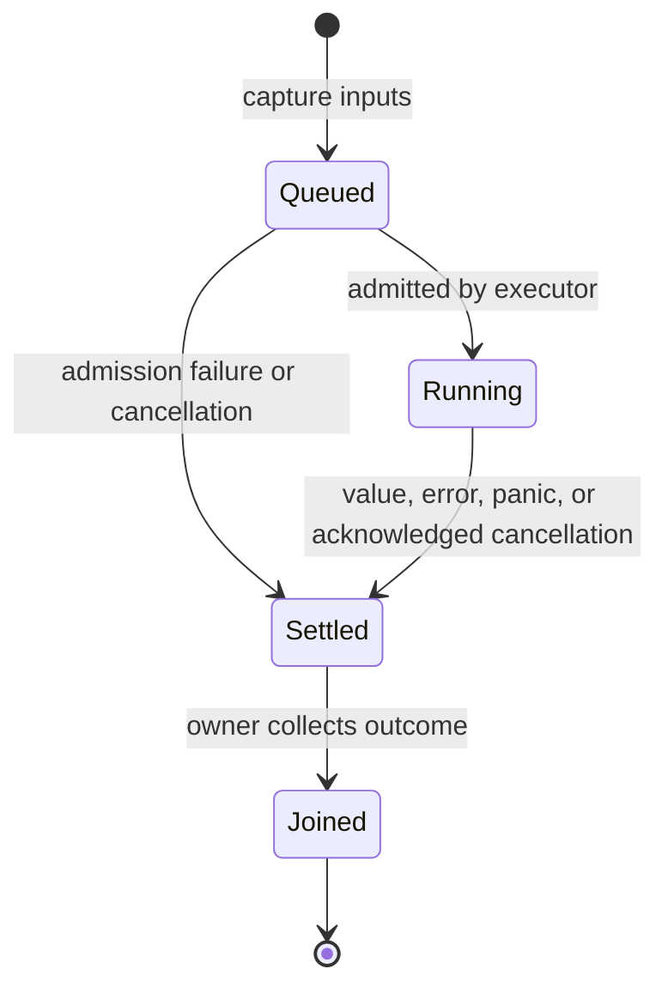

# Tasks and channels

[Documentation index](../README.md)

A **task** is a computation with one eventual result. A **task group** owns a
bounded collection of those computations. A **channel** transfers a sequence of
messages. Joining work and receiving messages are separate operations.

Concurrency is structured: every task has a lexical owner, and that owner cannot
finish until its children have finished. There are no implicit global task groups
or detached tasks.

## Starting and joining one task

```meowy
square <int32> : (value <int32>) { -> value * value }

job : >> square(12)
result : << job
```

`>> expression` evaluates the expression in a child task and produces
`<task<T>>`, where `T` is the expression's complete result type. Reading the
handle does not wait. `<< job` waits and consumes the handle exactly once.
`<<` only accepts a task or group, never an ordinary function result merely
because that function happens to spawn work internally.

Capture expressions execute in the parent before scheduling. For a call operand,
the callee and its arguments evaluate left-to-right in the parent; the call itself
runs in the child. For a block operand, its referenced outer values are captured
at submission, and its statements execute in the child. Copyable inputs are
copied; other owned inputs move. Explicit borrows must survive until the join.

For example, `>> work(next_id())` calls `next_id()` before scheduling and runs
`work` in the child. `>> { -> work(next_id()) }` runs both calls in the child,
subject to the captured function environments being transferable.

The join result is `<tasks.Outcome<T>>`, the union of `T` with
`tasks.Cancelled`, `tasks.Timeout`, `tasks.Panicked`, and `tasks.SpawnFailed`.
These alternatives are recoverable error types. A domain error emitted by the
computation remains part of `T`; it is not a task panic.

Starting a task is an explicit scheduling and possible allocation boundary.
If the executor cannot admit it, the returned handle is already completed with
`tasks.SpawnFailed`; the body never runs and transferred captures are released.
Joining requires no allocation for the result beyond the task's reserved storage.

## Bounded groups

```meowy
&squares<int32[4]>

&squares >> square(2)
&squares >> square(3)
&squares >> square(4)

results : << &squares
```

The annotation is a capacity, not a promise that four tasks will be submitted.
`<< &squares` seals the group, joins every submitted task, and consumes its result
storage. The result is a bounded list with capacity four and element type
`tasks.Outcome<int32>`. Its length is the number of submitted tasks.

Results are in **submission order**, regardless of completion order. Position 1
belongs to the first submitted task. Failed and cancelled tasks retain their
positions. Joining an empty group yields an empty list immediately.

Submissions require exclusive access to the group and cannot race with sealing.
Submitting past capacity is a panic, or a static error when provable. A failed
executor admission still occupies a slot with `tasks.SpawnFailed`. Check input
bounds or process batches when task counts are dynamic. The core has no unbounded
group hidden behind an omitted annotation.

A submission produces a borrowed `tasks.Ticket<T>` for cancellation and status.
The group owns its result; the ticket cannot be individually joined. The group
and its tickets cannot escape their declaring scope or be accessed after join.
Read `results[1]`, not `&squares[1]`, after joining.

## State and ownership



Cancellation is a request while work is running; a task stays running until it
acknowledges the request and finishes cleanup. A terminal outcome is published
once. `cancel()` on a settled task does nothing. Each child is joined exactly
once, either explicitly or during scope cleanup.

The runtime must not hold group administration locks while executing user code
or waiting for child completion. Tasks can run on different threads; scheduling
order and parallel execution are not promised. No program may depend on one
particular interleaving.

Once a child begins execution, it remains on the same worker thread through
completion and cleanup. Runtime waits suspend it and resume it on that worker;
other runnable work can use the worker during the wait. This permits a child to
acquire and release a thread-affine resource locally. Such a resource still
cannot cross a capture, result, or channel boundary without `tasks.Send`.
Worker pinning gives no scheduling-order or fairness guarantee.

## Deadlines and cancellation

```meowy
time : @"time"

&work<int32[4]>
&work.deadline(time.after(time.Millisecond.scale(250)))

ticket : &work >> square(10)
ticket.cancel()

outcomes : << &work
```

`time.ms` constructs a duration; `time.after` produces a monotonic absolute
deadline. A group deadline is set before its first submission and applies to all
its children. A standalone handle can set a deadline before joining; a deadline
already in the past requests cancellation immediately. Configuring a settled task
does not change its outcome. Control methods such as `deadline()` and `cancel()`
use synchronized task state and do not require a mutable handle binding. A child's
effective deadline is the earliest deadline inherited from its ancestors or set locally.

There is no millisecond literal buried in an operator. Deadline configuration is
separate from both submission and joining. A deadline is not a guarantee that
scope exit or a join will finish by that instant.

`cancel()` is idempotent and nonblocking. It requests cooperative cancellation.
Queued work can settle without running. Running work observes cancellation at
runtime waits, channel operations, or an explicit `tasks.checkpoint()`.
CPU-bound loops must include checkpoints when prompt cancellation matters.

Once a checkpoint acknowledges cancellation, control unwinds to the task boundary
and releases its owners; execution does not resume after that checkpoint. The
outcome is `tasks.Cancelled`, or `tasks.Timeout` when a deadline caused the first
cancellation request. Runtime waits wake to perform this same unwinding.

The first accepted cancellation cause is retained. A normal completion that wins
publication before cancellation is acknowledged remains a normal completion.
Fatal cleanup failure aborts the process. A recoverable panic during normal task
execution publishes `tasks.Panicked`, containing the diagnostic rather than
silently taking down sibling tasks.

Already performed side effects are not rolled back. Cancellation cannot force a
blocking foreign function to return safely. Such a call must finish or cooperate
before its task can release borrowed memory and settle.

## Scope exit

On normal fallthrough, `leave()`, `restart()`, or panic, a scope with unjoined
children requests cancellation for all unfinished children, joins every child,
and only then releases remaining local storage. It never detaches work to make
cleanup faster. This also applies when a function has already emitted a result.

Explicit joins observe outcomes. Implicit cleanup discards domain results after
releasing their owners, but must report unobserved `tasks.Panicked` and
`tasks.SpawnFailed` as a panic in the owner. Cancellation requested by cleanup is
expected and is not a second failure. During an existing unwind, additional child
failures attach to the original diagnostic instead of starting a second unwind.

A task handle cannot be emitted out of its lexical owner. A helper that starts
work must join it before completing, or receive a caller-owned group to submit
into. Passing such a group grants scoped submission access, not ownership or the
right to join it. An operation's public signature must expose this group parameter.

## Transfer and synchronization

Moving data to another task requires `tasks.Send`, for both captures and results.
A shared borrow requires `tasks.Sync` for its referent. An exclusive borrow can
cross into one child when its referent is transferable and the parent cannot
access it until the borrow ends. These capabilities never extend a lifetime:
channel messages cannot contain non-static external borrows, even when their
types satisfy both capabilities. References internal to an opaque owner, such
as a decoded document's views of bytes it owns, are not external borrows when
that owner's verified contract preserves them on transfer. An extracted view
of that owner is an ordinary external borrow and cannot outlive it.

### Capability rules

`tasks.Send` and `tasks.Sync` are compiler-known structural capabilities, not
application-defined declarations. `Send` permits transferring an owner between
tasks, including releasing it on the receiving worker. `Sync` permits sharing
immutable access between tasks. Neither capability permits concurrent exclusive
access. Derivation uses the entire type, not the currently selected alternative
of an unnarrowed union or a resource's observed runtime state.

| Type                                                                                           | `tasks.Send`                                   | `tasks.Sync`                                |
| ---------------------------------------------------------------------------------------------- | ---------------------------------------------- | ------------------------------------------- |
| `null`, `never`, booleans, fixed-width numbers, `isize`, `usize`, literal subtypes             | Yes                                            | Yes                                         |
| `string`                                                                                       | Yes, subject to its backing storage's lifetime | Yes                                         |
| Shared reference `&T`, immutable slice `T[]`                                                   | Exactly when `T` is `Sync`                     | Exactly when `T` is `Sync`                  |
| Exclusive reference `&!T`, `collections.MutSlice<T>`                                           | Exactly when `T` is `Send`                     | No; form a shared reborrow to share reads   |
| Ordinary or native record, closed union, bounded list, fixed `Array`, generated concrete error | Exactly when every constituent is `Send`       | Exactly when every constituent is `Sync`    |
| Non-capturing function item or pointer, including an unsafe callable                           | Yes                                            | Yes                                         |
| Capturing callable                                                                             | Exactly when every stored capture is `Send`    | Exactly when every stored capture is `Sync` |
| Raw pointer, erased `any`, erased `error`                                                      | No                                             | No                                          |
| Task handle, group, or ticket                                                                  | No                                             | No                                          |

A record's primary is a constituent. List alias metadata consists of immutable
names and inline positions and adds no capability restriction. A closure's
capture mode determines the stored constituent: a shared borrow checks its
referent's `Sync`, while a moved owner checks that owner's capability. Shared,
exclusive, and consuming call requirements remain in force; a shared borrow of
a `Sync` closure cannot invoke a method that requires exclusive access.

A non-capturing function pointer does not grant access to unsynchronized global
mutation. Within child tasks, safe access to module storage is restricted to
immutable `Sync` values or an opaque API whose contract provides synchronization.
This restriction also applies through helper calls. An unsafe callable retains
its caller-proven memory and thread-access preconditions when transferred.

Opaque types derive neither capability merely from their name, apparent fields,
or representation size. Their foundational-library contract must explicitly
grant a capability. The following grants apply to the documented owner families;
all retained borrows must still remain valid:

| Opaque type or family                                                                             | Capability grant                                                                                        |
| ------------------------------------------------------------------------------------------------- | ------------------------------------------------------------------------------------------------------- |
| `memory.Allocator`                                                                                | `Send` and `Sync`; its implementation synchronizes allocation/release across runtime threads            |
| `collections.Vector<T>`, `json.Document<T>`                                                       | `Send` when `T` is `Send`; `Sync` when `T` is `Sync`                                                    |
| `collections.Map<K, V>`                                                                           | Each capability requires it for `K` and `V`; its pure non-capturing hash/equality pointers satisfy both |
| `strings.Owned`, `strings.Builder`, `path.Owned`                                                  | `Send` and `Sync`; mutation still needs exclusive access                                                |
| `channel.Sender<T>`, `channel.Receiver<T>`                                                        | `Send` when `T` is `Send`; never `Sync`                                                                 |
| `time.Timer`, `time.Ticker`, `fs.File`, process child/pipe owners, network socket/listener owners | `Send`, never `Sync`                                                                                    |
| `tasks.Cancelled`, `tasks.Timeout`, `tasks.Panicked`, `tasks.SpawnFailed`                         | `Send` and `Sync`, including any runtime-owned diagnostic storage                                       |

An opaque type with an additional grant in its own API chapter uses that grant;
otherwise the default is neither capability. An opaque constructor cannot hide
a non-transferable captured owner or a borrowed referent behind an unconditional
grant. User-defined error payloads and public result records follow the structural
rule above; boxing into `error` or `any` loses transferability.

```meowy
read <int32> : (value <&int32>) { -> *value }
number := 7
job : >> read(&number)  # Accepted: int32 is Sync; number survives the join. #
result : << job
```

**Rejected — an exclusive reference cannot itself be shared between tasks:**

```meowy
<ExclusiveInt> : <&!int32>
inspect <null> : (value <&ExclusiveInt>) {}
number := 7
exclusive : &!number
job : >> inspect(&exclusive)  # &!int32 is not Sync. #
```

For shared reads, pass a shared reborrow of the original referent instead.

Submission makes preceding parent writes visible to the child. Completion followed
by join makes child writes visible to the owner. A successful channel send/receive
pair provides the same visibility for the transferred message. Atomics and locks
provide explicit shared-state synchronization; ordinary data races are invalid.

## Channels

`channel.bounded<T>(allocator, capacity)` creates a bounded queue and returns a
record with a `sender` and a `receiver`, or an allocation failure. The capacity
is measured in messages. Capacity zero creates a rendezvous: a sender and receiver
must meet before the message transfers.

There may be multiple sender owners, created by explicit `sender.clone()`, and
one receiver owner. Receiver cloning is not part of the core contract. Shared
queue storage lives until the last endpoint is released. Queue allocation is
explicit; sending within the reserved capacity does not allocate queue storage.

| Operation                | Result and behavior                                                 |
| ------------------------ | ------------------------------------------------------------------- |
| `sender.send(value)`     | `<null><channel.Rejected<T>>`; waits for space or a receiver        |
| `sender.try_send(value)` | Also permits `channel.Full<T>`; never waits                         |
| `receiver.receive()`     | `<channel.Item<T>><channel.Closed>`; waits for a message or closure |
| `receiver.try_receive()` | Also permits `channel.Empty`; never waits                           |
| `sender.close()`         | Consumes this sender; other senders may still send                  |
| `receiver.close()`       | Consumes the receiver, rejects sends, and releases queued messages  |

`channel.Item<T>` is a record with `value <T>`. The wrapper keeps a received
`null`, error, or closure-like payload distinguishable from a closed channel.
`Rejected<T>` and `Full<T>` own the unsent `value`; callers can recover it. If a
blocked send is cancelled, task unwinding releases its still-owned message.

A successful send moves the message into the queue or waiting receiver. All
successfully transferred messages are delivered once, in queue insertion order.
Sends from a single task preserve program order; concurrent senders have no
preordained order. Fairness between waiting tasks is not guaranteed.

Dropping or closing the last sender closes the send side. The receiver first
drains messages already queued, then receives `channel.Closed` on every further
receive. Closing the receiver wakes blocked senders with `Rejected<T>` and releases
queued messages. A send racing with receiver closure either transfers successfully
before closure or returns its unsent value; a successful send does not guarantee
that the receiver will process it before closing.

Channel waits are cancellation points. A parent task can use a deadline to bound
cooperative channel operations; there is no distinct polling loop required to
notice cancellation. Cancellation never invents a successful send or receipt.

## Backpressure and deadlock

A full queue stops a producer until the consumer makes room. Join the producer
**after** consuming its output, or join producer and consumer from a third task.
Joining a producer before draining its bounded queue can deadlock. Likewise, a
consumer cannot observe closure while the parent retains an unused sender clone.

Group capacity limits the number of submissions and result slots. Channel capacity
limits queued messages. Executor worker count limits simultaneously executing
work. These are separate budgets; none can be inferred from the others.

The core starts submitted work eagerly, subject to executor admission. Lazy
iteration belongs to a pull-based iterator API with its own lifetime contract;
iterating a group never changes its scheduling policy. Completion-order streaming
can be expressed with a channel carrying tagged results while the group continues
to own and join the workers.

See the [ordered task](../programs/tasks/main.mwy) and
[producer/consumer](../programs/channel/main.mwy) programs for complete flows.

The [standard library task/channel APIs](stdlib/tasks-and-channels.md) list
result types and endpoint operations. [Time](stdlib/time-and-date.md) defines
monotonic deadlines, fixed units, and explicit timer/ticker owners.
